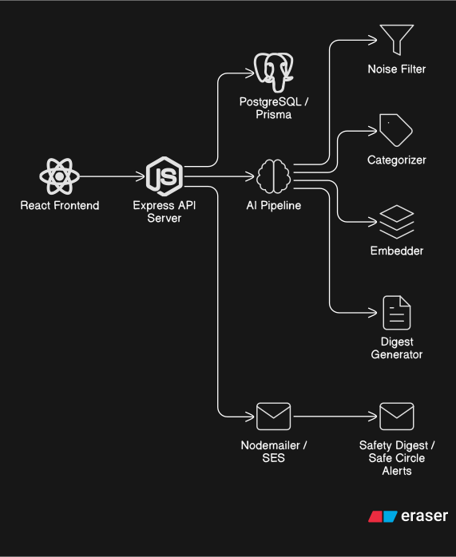
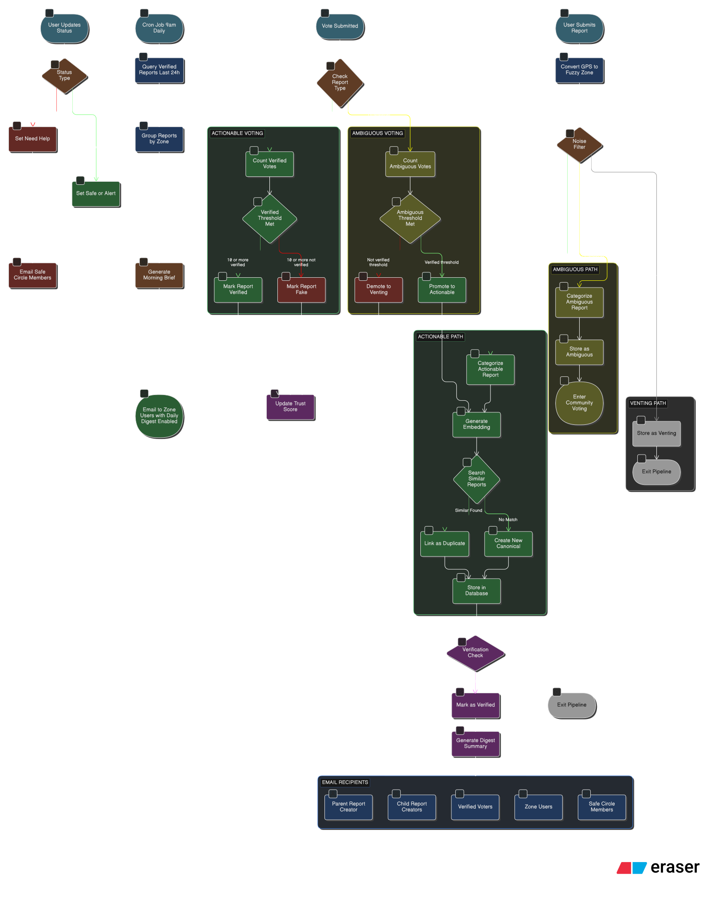

# 🛡️ Nexwatch: Community Guardian Platform

**Candidate Name:** Shashank Kumar
**Scenario Chosen:** Community Safety & Digital Wellness

---

## 🚀 Quick Start
### ● Prerequisites
- **Node.js**: v20 or higher
- **PostgreSQL**: Required for the Prisma database
- **Ollama**: (Optional) For local AI features (`llama3` model recommended)
- **Environment Variables**: Create a `.env` in the `server/` directory based on `.env.example`.

### ● Run Commands
1. **Backend:** `cd server && npm install && npx prisma migrate dev && npm run dev`
2. **Frontend:** `cd client && npm install && npm run dev`

### ● Test Commands
`cd server && npm test`

---

## 🤖 AI Disclosure
- **Did you use an AI assistant (Copilot, ChatGPT, etc.)?** Yes
- **How did you verify the suggestions?**
    - Manually audited all generated service logic, especially the report categorization and grouping pipeline implementation and Prisma schema relations. Also ran tests to make sure the logic is being implemented correctly and not missing any edge case.
- **Give one example of a suggestion you rejected or changed:**
    - Initially the suggestion was to generate a calm summary with LLM for every report that has been submitted but actually it was not useful to generate the calm summary for each reports before they are pushed to the verified group and creates unnecessary load on server and token expense so I wiped off the entire logic of that feature from server and the database. 

---

## ⚖️ Tradeoffs & Prioritization
- **What did you cut to stay within the 4–6 hour limit?**
    - **Asynchronous Task Queue:** AI processing is currently performed synchronously. This job could have been given to any worker or Lambda function through a Queue system to reduce server load.
    - **Vector Database:** I implemented cosine similarity in JavaScript but could have used any vector db like pgvector for better performance.
    - **Better UI/UX:** Would have made the UI more friendly and proper toasts messages for updates on all the pages.
    - **Guardrails:** Would have implemented a guardrail for the AI models so that anyone cannot perform prompt injection to break the pipeline.
    - **Simulation:** Wanted to add simulations that would make it appear like live data of real time reports are being scraped from social medias and ingested into the pipeline for filtering and verification.
    - **State Management:** Would have added state management using Redux in the frontend for proper state management.
    - **Optimizations: ** Didnot look deep into the query optimization, data flow optimizations and caching as the focus was to complete the working prototype.

- **What would you build next if you had more time?**
    - **Left Overs:** Firstly fixing and implementing everything I had cut off because of time limit.
    - **Real-time Safe Circle Pings:** Implementing WebSockets for instant status updates.
    - **ML Model for Fallback:** Handling the fallback due to unavailability of LLM models by training a custom ML model locally and inferring it to get better results as compared to rule based decisions
    - **Mobile App:** Converting this web app to mobile app to leverage the real time location capturing when user is not using phone and proper real time notifications to the users through the app instead of emails which may get unseen.
    
- **Known limitations**
    - **Rate Limiting:** No API-level rate limiting is currently implemented.
    - **Real Time Updates:** No any real time location updates or notifications.
    - **AI Response:** AI may not respond correctly everytime as expected because of being probabilistic in nature. 
    - **Market Information:** Need the market information to decide the bar to promote or demote a report to different levels and how much points to increment or decrement from user for any action they perform.

---

# Nexwatch — Technical Design & Project Documentation

## 1. Project Overview
Nexwatch is a high-trust community safety platform designed to solve the problem of "Alert Fatigue" and "Safety Anxiety" in modern digital neighborhoods. By leveraging AI for intelligent noise filtering and semantic deduplication, Nexwatch ensures that only verified, actionable, and calm safety information reaches the community.

### Target Audience
- **Neighborhood Groups:** Seeking verfied local intel without social media toxicity.
- **Remote Workers:** Monitoring home/network security in real-time.
- **Vulnerable Users:** Elderly or non-tech-savvy users needing simplified, trustworthy alerts.

---

## 2. System Architecture & Design

### High-Level Component Diagram



---

### Data Flow Diagram



### Directory Structure
```text
nexwatch/
├── client/                 # React (Vite) Frontend
│   └── apps/web/src/
│       ├── components/     # UI Components (Shadcn/ui)
│       ├── pages/          # Full-page views
│       ├── api/            # Axios API wrappers
│       └── contexts/       # Auth & Global state
├── server/                 # Node.js (Express) Backend
│   ├── ai/                 # AI Logic & Fallback rules
│   ├── routes/             # API Endpoint Controllers
│   ├── services/           # Business Logic (Dedup, Verify, Trust)
│   ├── prisma/             # Database Schema
│   ├── data/               # Synthetic Seeding Data
│   └── src/
│       ├── index.js        # Entry point
│       └── middleware/     # Auth, Validation, Error Handling
└── DOCUMENTATION.md        # You are here
```

---

## 3. The Report Lifecycle (Data Flow)

When a user submits a report, it travels through a sophisticated multi-stage pipeline:

1. **Submission:** User enters text. The system captures the "Zone" (either via GPS reverse-geocoding or manual selection) and discards raw coordinates immediately on the client side for privacy.
2. **Noise Filtering (AI/Fallback):**
   - AI classifies the text as `ACTIONABLE`, `VENTING`, or `AMBIGUOUS`.
   - `VENTING` reports are logged but not promoted to the community feed.
3. **Structured Classification:**
   - AI extracts `category` (e.g., Phishing, Theft) and `severity` (CRITICAL to LOW).
4. **Semantic Deduplication:**
   - The report is converted into a vector embedding.
   - It is compared against recent reports in the same zone using **Cosine Similarity**.
   - If a match is found (>=0.75 similarity), it is linked to a "Canonical" (original) report.
5. **Community Verification:**
   - Once a cluster (Canonical + Duplicates) reaches a threshold (e.g., 1 parent + 3 duplicate reports), it is marked as `isVerified`.
   - User votes (Verified/Not Verified) further influence the trust score of the reporter.
6. **Smart Digest Generation:**
   - Verified CRITICAL/HIGH alerts trigger an AI-generated **Safety Digest**.
   - Digests include some actionable steps depending upon the incident description (e.g., "Change your passwords," "Avoid Main St").
   - Sent via Email/Push to all users in the affected zone as well as those who participated in upvoting that incident.

---

## 4. Core Service Breakdown

### AI Services (`server/ai/`)
- **`noiseCheck.js` / `categorise.js`**: Orchestrates calls to the AI model (Ollama/Gemini) with fallback protection.
- **`fallback.js`**: Contains the "Responsible AI" safety net—keyword-based rules that provide 100% uptime even if the AI is unavailable.

### Logic Services (`server/services/`)
- **`dedup.js`**: Handles the math for semantic grouping.
- **`verify.js`**: Manages the promotion of reports to verified status.
- **`trust.js`**: Implements the "Trust Economy" (e.g., +10 for verified reports, -20 for 10+ noise votes).
- **`digestTrigger.js`**: The orchestration layer that connects verification to communication.

---

## 5. System Architecture Design Choices

### A. Relational Data Modeling (Prisma/PostgreSQL)
**Choice:** Utilizing a strict relational schema for report clustering and trust management.
**Rationale:** The core value of Nexwatch is "Verified Truth." This requires robust relational integrity where `Reports` belong to `Users`, `Votes` link `Users` to `Reports`, and `Duplicates` are strictly tied to a single `Canonical` report. A relational DB allows for efficient aggregation (counting votes/duplicates) and ensures data consistency in a community-driven trust economy.

### B. Service-Layer Isolation
**Choice:** Separating business logic (Deduplication, Verification, Digest Triggering) into dedicated service modules, independent of Express routes.
**Rationale:** This promotes the **Single Responsibility Principle**. Controllers in `reports.js` only handle request validation and response orchestration, while the complex logic of "Is this a duplicate?" or "Should we verify this now?" is isolated in `services/`. This architecture makes the system significantly easier to test and maintain.

### C. Persistent vs. Transient Data (Privacy at the Edge)
**Choice:** Treating raw GPS coordinates as **transient** data that never hits the backend or the database.
**Rationale:** From an architectural standpoint, safety is a liability if it leaks. By resolving coordinates into fuzzy strings (`Zone`, `City`) at the client level, we fulfill the functional requirement (localized alerts) without creating a permanent tracking database of user movements and respecting their privacy.

### D. AI Provider Abstraction
**Choice:** Using an OpenAI-compatible interface (via `OpenAI` library) but abstracting the backend (Gemini/Ollama/OpenAI/Claude).
**Rationale:** This allows the platform to pivot between Cloud AI (for high-power extraction) and Local AI (Ollama for maximum data privacy/low cost) by merely changing environment variables. The business logic remains provider-agnostic.

### E. Pipeline Latency (Tradeoff)
**Choice:** Synchronous, in-process AI execution for the prototype.
**Rationale:** To meet the time constraint requirement, I chose synchronous execution over an asynchronous job queue. This ensures immediate feedback for the user but represents a known bottleneck for real-world where a task queue (e.g., BullMQ) would be necessary for processing heavy LLM tasks.

---

## 6. Future Roadmap
1. **Interactive Safe Circles:** Real-time location sharing within a 15-minute emergency window.
2. **AI Trend Forecasts:** "We've seen 5 phishing reports in Jubilee Hills this morning—be alert for SMS scams today."
3. **Mobile App Implementation:** To improve the use of notification and location services and work with alerts in real time.
4. **Social Media Data:** Scraping real data from social media to get reports from worldwide and cater them in a noise free format to the users.